# Sentiment-Analysis

### Abstract
Sentiment Analysis is a technique that utilizes machine learning and natural language processing (NLP) to analyze and classify subjective data. This documentation provides an overview of a sentiment analysis system that employs big data to analyze and classify data. The document covers the project goals, objectives, scope, limitations, constraints, feasibility study, work breakdown structure, system requirement specifications, hardware requirements, system design, and architecture.

### Introduction
Sentiment analysis using big data enables businesses to gain insights into their customer's opinions and attitudes towards their products, services, or brands. The goal of this project is to design and implement a sentiment analysis system capable of processing large volumes of data in real time.

### Project Goals and Objectives
The primary goal of this project is to design and implement a sentiment analysis system that can analyze and classify large volumes of data in real time. The objectives include:
- Develop an automated system for analyzing and classifying data from Twitter.
- Create an intuitive user interface for real-time visualization and analysis of customer sentiment data.
- Implement a machine learning algorithm for accurate classification of customer sentiments.
- Develop a scalable system capable of handling large volumes of data in real time.

### Project Scope
This project includes the development of a sentiment analysis system that can analyze and classify data from Twitter. The system will include a user interface allowing businesses to visualize and analyze customer sentiment data in real time.

### Project Limitations and Constraints
The accuracy of the sentiment analysis system is influenced by the quality and quantity of data, as well as language and cultural differences. Hardware constraints, such as processing power, may also affect the system's accuracy. Data availability is a key constraint for this project.

### Feasibility Study
The feasibility study involves assessing data availability and technical feasibility.
- **Availability of Data:** Critical to sentiment analysis, data must be sourced from Twitter.
- **Technical Feasibility:** The system requires big data technologies like Hadoop and Spark for processing large volumes of data in real time.

### Hardware Requirements
The hardware requirements for the sentiment analysis system:
- A system with a minimum of 4GB RAM
- Adequate storage capacity for large volumes of data
- High-speed internet connectivity for real-time data processing

### Architectural Diagram
The system consists of the following components:
1. Data Ingestion – Tweepy
2. Storing Data - HDFS
3. Data Processing – PySpark
4. Data Visualization - Plotly
5. Sentiment Analysis – VARER

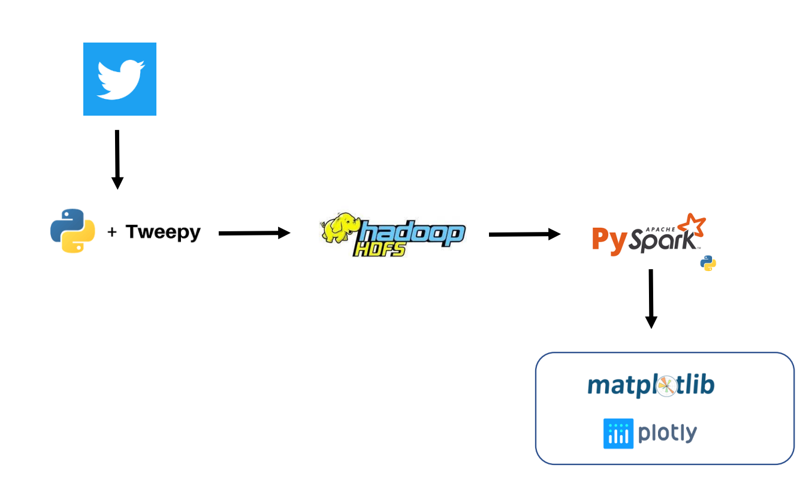

### Code
Import required libraries such as InsecureClient from hdfs, tweepy, JSONEncoder, SparkSession, pandas, 
dump, dumps, load, datetime, explode, col, pyspark, plotly.express, and warnings. then create client 
objects for Hadoop distributed file system (HDFS) and Twitter API using the InsecureClient and 
tweepy.Client, respectively.
The code then defines a Twitter query for retrieving recent tweets related to #WWEBacklash or 
#WWEBacklash or #wwebacklash or #WWEBACKLASH that are in English and are not retweets. It then 
retrieves the tweets using the tweepy.Paginator and stores them in a list called testList. The search 
parameters include tweet_fields such as id, author_id, text, attachments, context_annotations, 
conversation_id, edit_controls, entities, possibly_sensitive, public_metrics, referenced_tweets, withheld, 
created_at, and geo, and max_results parameter is set to 100.
The code also defines two lists startTimeList and endTimeList, which define the start and end times for 
retrieving the tweets. For each time interval defined in these lists, the code retrieves the tweets by 
calling the tweepy.Paginator again and appends them to the testList. Finally, save the list of tweets in a 
JSON file named WWEBacklash1.json using the JSON.dump function. The JSON file is saved in the 
specified file path C:\\Users\\likhi\\Downloads\\Gorang\\.
Then, Change the tweet hashtag from #WWEBacklash to #Coronation and #KentuckyDerby as these 
hashtags are trending at this point.
Also, we did the same thing to extract tweets related to Car Companies.

- Data will stored within respective folders

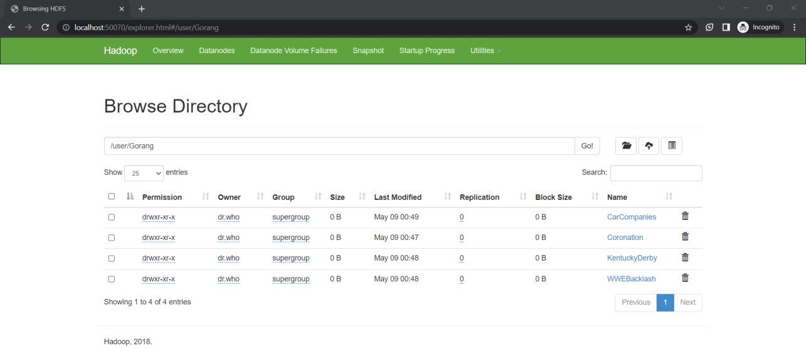
  
- Tweets from car companies within respective folders

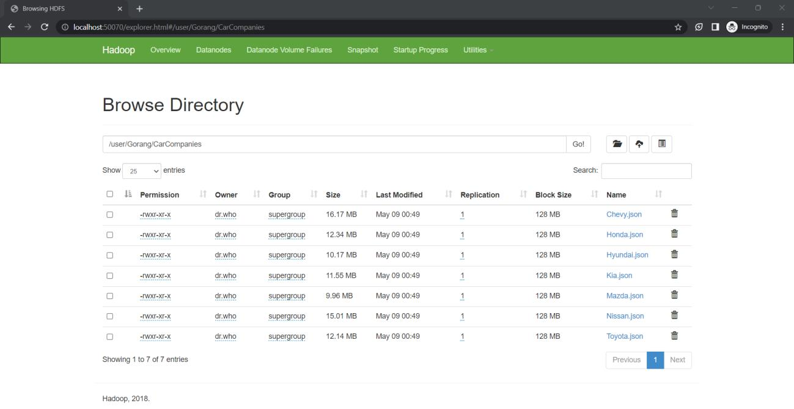

### Analysis and Visualization
- Most Liked Tweets for Coronation, WWE Backlash, Kentucky Derby

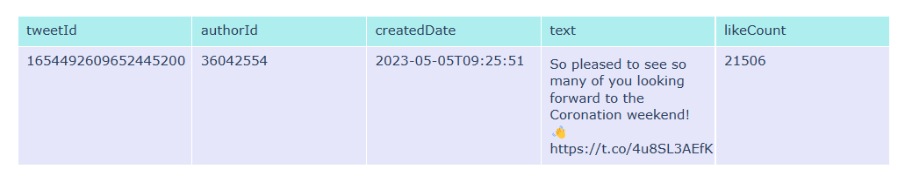
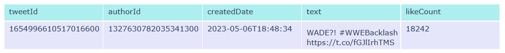
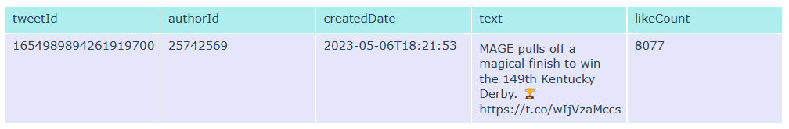

- Number of Sensitive Tweets (Controversial)

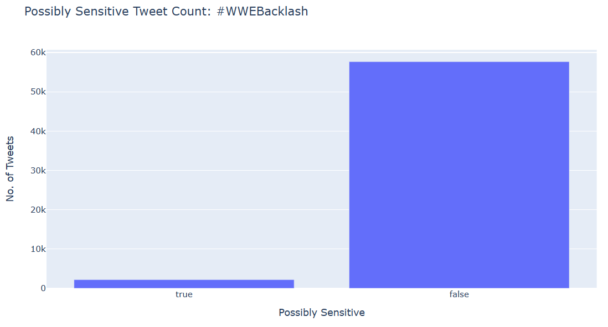
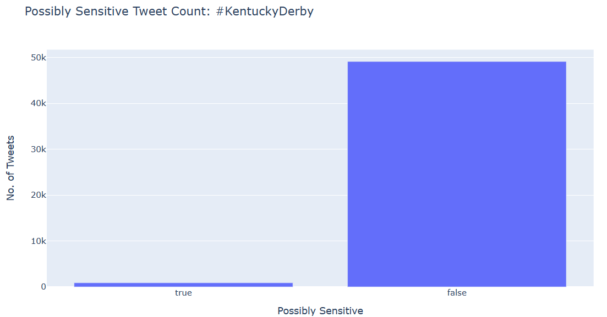
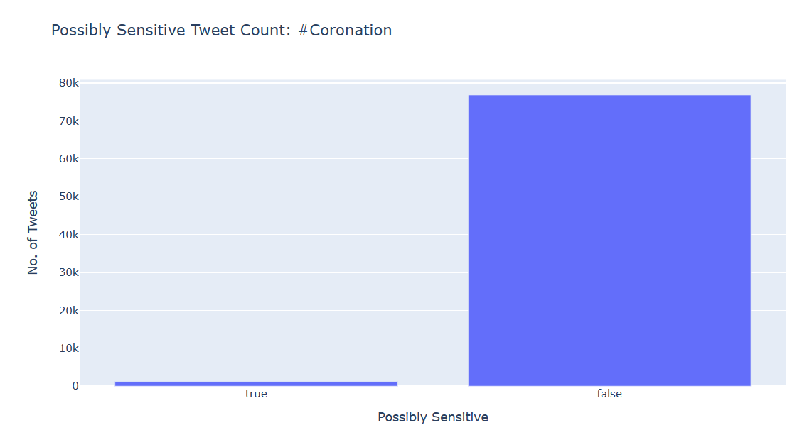

- Analysis of tweets related to different car companies (number of tweets, speed, safety)
  - Number of tweets posted by different car companies
  
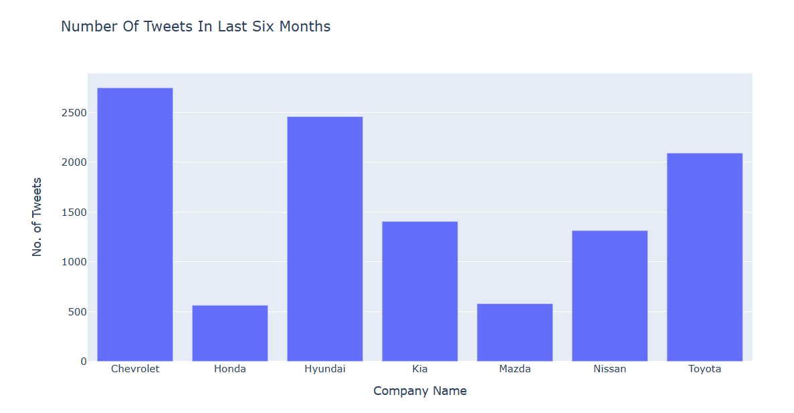

  - Speed of cars related tweets by different companies

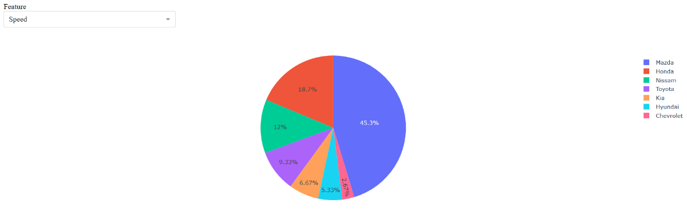

  - Safety of the cars related tweets

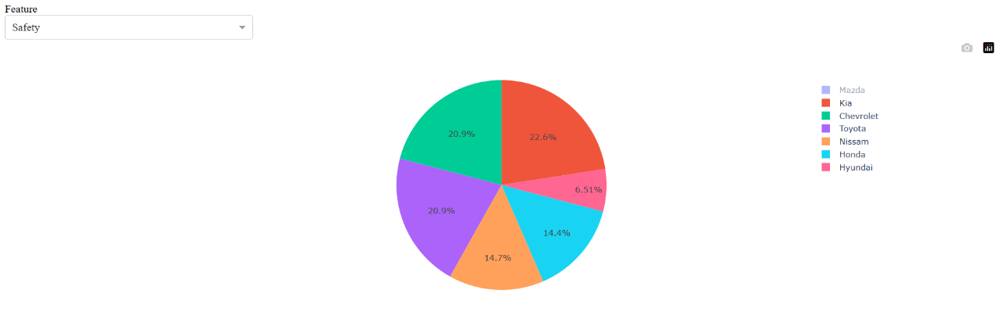

### Future Scope
The pre-processed data can be used for classification problems and Natural Language Processing (NLP). Classification involves assigning labels based on features, while NLP tasks include text classification and language translation.

### Reference
**Academic References:**
1. [The Hadoop Distributed File System](https://ieeexplore.ieee.org/document/5595506)
2. [Recent Trends in Big Data using Hadoop](https://www.inderscience.com/info/inarticle.php?artid=100162)
3. [Analysis of Social Data Using Hadoop Ecosystem](https://www.ijcst.org/ijcst/issues/volume7/issue4/paper19.pdf)
4. [Performance Evaluation of Cloud service with Hadoop for Twitter Data](https://www.iaescore.com/journals/index.php/IJECECS/article/view/11039)

**Twitter Data Analysis References:**
1. [MapReduce: Simplified Data Processing on Large Clusters](https://dl.acm.org/doi/10.1145/1327452.1327492)
2. [A review of sentiment analysis in Twitter data using Hadoop](https://www.inderscience.com/info/inarticle.php?artid=71531)
3. [Twitter Data Analysis using Hadoop](https://ijariie.com/AdminUploadPdf/Twitter_Data_Analysis_using_Hadoop_ijariie5544.pdf)
4. [Twitter data analysis using Hadoop ecosystem and Apache zeppelin](https://www.sciencedirect.com/science/article/pii/S2468457118310429)
5. [Real-time Twitter data analysis using Hadoop ecosystem](https://www.tandfonline.com/doi/full/10.1080/23311916.2018.1534519)

**Additional References:**
- [Hadoop Distributed File System](https://hadoop.apache.org/docs/stable/hadoop-project-dist/hadoopcommon/ClusterSetup.html)
- [Tweepy Documentation](https://docs.tweepy.org/en/stable/)
- [PySpark Documentation](https://spark.apache.org/docs/latest/api/python/)
- [Plotly Documentation](https://matplotlib.org/stable/index.html)
- [HDFS Python Library](https://pypi.org/project/hdfs/)
- [VADER Sentiment Analysis](https://pypi.org/project/vaderSentiment/)
